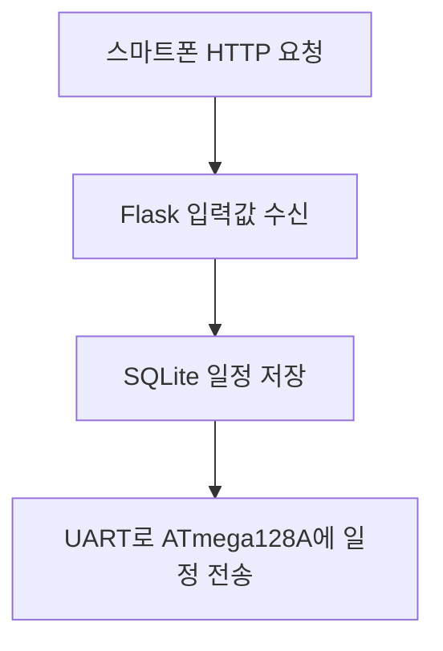

# SLOT-GUARD Raspberry Pi 로컬 웹 시스템 구현

SLOT-GUARD는 인터넷이나 전용 스마트폰 앱 없이 동작하는 정제 배출 관리 장치입니다.

Raspberry Pi가 자체 Wi-Fi와 웹 화면을 제공하고, ATmega128A가 DS1307의 시간을 기준으로 일정 판정과 정제 배출 감지를 담당합니다. 관리자는 스마트폰 웹브라우저로 장치에 직접 접속하여 일정과 배출 기록을 확인합니다.

> [!IMPORTANT]
> 이 시스템이 확인하는 것은 사용자의 실제 복약이나 삼킴 여부가 아니라 **정제가 배출구 센서를 통과했는지 여부**입니다.

## 목차

- [3. Raspberry Pi에서 구현할 프로그램](#3-raspberry-pi에서-구현할-프로그램)
  - [3.1 자체 Wi-Fi 생성](#31-자체-wi-fi-생성)
  - [3.2 SQLite 데이터베이스](#32-sqlite-데이터베이스)
  - [3.3 Flask 웹서버](#33-flask-웹서버)
- [4. Raspberry Pi와 ATmega128A 통신](#4-raspberry-pi와-atmega128a-통신)
- [5. 시간을 ATmega128A가 판단해야 하는 이유](#5-시간을-atmega128a가-판단해야-하는-이유)
- [6. 스마트폰에서 해야 하는 것](#6-스마트폰에서-해야-하는-것)
- [7. 프로그램 파일 구성](#7-프로그램-파일-구성)
- [8. 구현 순서](#8-구현-순서)
- [공식 참고 문서](#공식-참고-문서)

## 3. Raspberry Pi에서 구현할 프로그램

Raspberry Pi에는 다음 네 가지 기능이 필요합니다.

1. 자체 Wi-Fi 핫스팟 생성
2. SQLite 데이터베이스 저장
3. Flask 웹서버 제공
4. ATmega128A와 UART 통신

### 3.1 자체 Wi-Fi 생성

Raspberry Pi가 다음 Wi-Fi를 생성합니다.

| 항목 | 설정값 |
| --- | --- |
| SSID | `SLOT-GUARD` |
| 비밀번호 | 별도로 지정 |
| Raspberry Pi IP | `192.168.4.1` |

Raspberry Pi OS Bookworm 이후에는 NetworkManager가 기본 네트워크 관리 도구입니다. 먼저 OS와 NetworkManager를 확인합니다.

```bash
cat /etc/os-release
nmcli --version
```

WLAN 국가를 한국으로 설정합니다.

```text
sudo raspi-config
└─ Localisation Options
   └─ WLAN Country
      └─ KR Korea
```

핫스팟을 생성합니다.

```bash
sudo nmcli device wifi hotspot \
    ifname wlan0 \
    con-name slotguard-ap \
    ssid SLOT-GUARD \
    password '사용할비밀번호'
```

IP를 `192.168.4.1`로 고정하고 자동 시작을 설정합니다.

```bash
sudo nmcli connection modify slotguard-ap \
    ipv4.method shared \
    ipv4.addresses 192.168.4.1/24 \
    connection.autoconnect yes
```

설정을 적용합니다.

```bash
sudo nmcli connection up slotguard-ap
```

설정 결과를 확인합니다.

```bash
ip -4 address show wlan0
nmcli connection show --active
```

다음 주소가 표시되면 정상입니다.

```text
192.168.4.1/24
```

NetworkManager의 `ipv4.method shared`는 접속한 스마트폰에 IP를 자동 할당하는 DHCP 기능도 제공합니다.

> 패키지 설치는 핫스팟 전환 전에 완료하거나, 유선 LAN으로 인터넷을 연결한 상태에서 진행하는 것이 좋습니다.

### 3.2 SQLite 데이터베이스

Raspberry Pi의 SD 카드에 일정과 정제 배출 상태를 저장합니다.

#### 일정 테이블

```sql
CREATE TABLE schedules (
    id           INTEGER PRIMARY KEY AUTOINCREMENT,
    pack_id      INTEGER NOT NULL,
    slot         INTEGER NOT NULL,
    scheduled_at TEXT NOT NULL,
    status       TEXT NOT NULL DEFAULT 'WAITING',
    dispensed_at TEXT,
    synced       INTEGER NOT NULL DEFAULT 0
);
```

각 필드의 의미는 다음과 같습니다.

| 필드 | 내용 |
| --- | --- |
| `id` | 일정 레코드 고유 번호 |
| `pack_id` | 블리스터 교체 회차 |
| `slot` | 1~10번 약 슬롯 |
| `scheduled_at` | 복용 예정 시각 |
| `status` | `WAITING`, `DISPENSED`, `MISSED` |
| `dispensed_at` | 정제 배출 감지 시각 |
| `synced` | ATmega128A에 일정이 전달됐는지 여부 |

SQLite는 별도의 데이터베이스 서버가 필요 없고 하나의 파일로 저장됩니다. 트랜잭션 단위 기록을 지원하므로 이 정도 규모의 MVP 로그 저장에 적합합니다.

데이터베이스 파일은 다음 위치에 둘 수 있습니다.

```text
/home/사용자명/slotguard/slotguard.db
```

### 3.3 Flask 웹서버

Flask는 스마트폰에 다음 세 화면을 제공합니다.

#### ① 현재 상태 화면

```text
현재 포장: 3회차
배출 완료: 6개
미배출: 1개
대기: 3개
장치 통신: 정상
```

#### ② 일정 등록 화면

관리자가 다음 정보를 입력합니다.

```text
슬롯: 7번
예정 날짜: 2026-07-24
예정 시각: 09:00
```

스마트폰에서 저장 버튼을 누르면 다음 과정이 실행됩니다.



#### ③ 배출 기록 화면

| 예정 시각 | 슬롯 | 상태 | 배출 시각 |
| --- | ---: | --- | --- |
| 7월 19일 09:00 | 1 | 정제 배출 확인 | 09:04 |
| 7월 19일 18:00 | 2 | 미배출 | - |
| 7월 20일 09:00 | 3 | 정제 배출 확인 | 09:11 |

#### Python 환경 설치

```bash
sudo apt update
sudo apt install -y python3-venv

mkdir -p ~/slotguard
cd ~/slotguard

python3 -m venv .venv
.venv/bin/pip install flask pyserial
```

#### URL 구성

Flask는 URL별로 기능을 나눕니다.

| HTTP 메서드 | URL | 기능 |
| --- | --- | --- |
| `GET` | `/` | 전체 상태 |
| `GET` | `/schedules` | 일정 목록 |
| `POST` | `/schedules` | 일정 등록 |
| `GET` | `/logs` | 배출 기록 |
| `GET` | `/api/status` | 장치 상태 반환 |

웹서버는 다음 주소에서 실행합니다.

```text
0.0.0.0:5000
```

`127.0.0.1`이 아니라 `0.0.0.0`에 바인딩해야 스마트폰에서 접속할 수 있습니다.

## 4. Raspberry Pi와 ATmega128A 통신

UART는 사람이 읽을 수 있는 문자열 프로토콜로 시작하는 것이 가장 쉽습니다. 각 메시지의 끝에는 줄바꿈 문자 `\n`을 붙입니다.

### 스마트폰에서 일정을 저장했을 때

Raspberry Pi에서 ATmega128A로 다음 명령을 전송합니다.

```text
SET,03,260719,0900\n
```

| 필드 | 의미 |
| --- | --- |
| `SET` | 일정 등록 명령 |
| `03` | 슬롯 3번 |
| `260719` | 2026년 7월 19일 |
| `0900` | 09시 00분 |

ATmega128A는 다음 응답을 보냅니다.

```text
ACK,03\n
```

`ACK`가 수신되면 Raspberry Pi가 `synced`를 `1`로 변경합니다.

```sql
UPDATE schedules
SET synced = 1
WHERE slot = 3;
```

### 정제가 배출되었을 때

ATmega128A에서 Raspberry Pi로 다음 메시지를 전송합니다.

```text
DISPENSED,03,260719,090412\n
```

| 필드 | 의미 |
| --- | --- |
| `DISPENSED` | 정제 배출 감지 |
| `03` | 슬롯 3번 |
| `260719` | 2026년 7월 19일 |
| `090412` | 09시 04분 12초 |

Raspberry Pi는 해당 일정을 다음과 같이 갱신합니다.

```sql
UPDATE schedules
SET status = 'DISPENSED',
    dispensed_at = '2026-07-19 09:04:12'
WHERE slot = 3;
```

### 허용 시간 동안 배출되지 않았을 때

ATmega128A에서 Raspberry Pi로 다음 메시지를 전송합니다.

```text
MISSED,03,260719,100000\n
```

Raspberry Pi는 해당 일정의 상태를 `MISSED`로 변경합니다.

```sql
UPDATE schedules
SET status = 'MISSED'
WHERE slot = 3;
```

## 5. 시간을 ATmega128A가 판단해야 하는 이유

이 장치는 인터넷 없이 운용하므로 Raspberry Pi가 NTP 서버에서 시간을 자동 보정하지 못할 수 있습니다. Raspberry Pi 4 자체에는 배터리 백업 RTC가 없기 때문에 전원이 완전히 꺼졌다 켜지면 시간이 틀어질 가능성이 있습니다.

따라서 시간 관련 책임을 다음과 같이 분리합니다.

| 장치 | 역할 |
| --- | --- |
| DS1307 | 현재 날짜와 시간 유지 |
| ATmega128A | 예정 시각과 현재 시각 비교, 지정 슬롯 허용, 허용 시간 초과 판단, 실제 배출 시각 생성 |
| Raspberry Pi | ATmega128A가 알려 준 시간을 데이터베이스에 저장하고 웹 화면으로 제공 |

일정 원본은 Raspberry Pi의 SQLite에 저장하고, ATmega128A EEPROM에도 복사합니다. 관리자가 1~2주에 한 번만 일정을 변경하므로 EEPROM 쓰기 횟수도 많지 않습니다.

## 6. 스마트폰에서 해야 하는 것

스마트폰에는 별도의 프로그램을 설치할 필요가 없습니다.

### 최초 한 번

1. `SLOT-GUARD` Wi-Fi를 선택합니다.
2. 장치 비밀번호를 입력합니다.
3. 인터넷 없음 경고가 표시되면 연결 유지를 선택합니다.
4. 웹브라우저에서 `http://192.168.4.1:5000`에 접속합니다.
5. 웹페이지를 홈 화면에 바로가기로 추가합니다.

### 담당자 방문 시

1. `SLOT-GUARD` Wi-Fi에 연결합니다.
2. 홈 화면의 SLOT-GUARD 바로가기를 실행합니다.
3. 지난 1~2주 동안의 기록을 확인합니다.
4. 미배출 슬롯을 확인합니다.
5. 새 블리스터 일정을 등록합니다.
6. 장치 전송 완료 여부를 확인합니다.

### 화면 상태 표시

| 표시 색상 | 상태 | 의미 |
| --- | --- | --- |
| 회색 | 대기 | 예정 시각 전 |
| 파란색 | 복용 허용 | 현재 누를 수 있음 |
| 초록색 | 정제 배출 확인 | 정제가 배출 센서를 통과함 |
| 빨간색 | 미배출 | 허용 시간 안에 배출되지 않음 |
| 주황색 | 전송 안 됨 | ATmega128A가 일정을 확인하지 못함 |

## 7. 프로그램 파일 구성

복잡한 프레임워크 없이 다음 정도로 구성합니다.

```text
slotguard/
├── app.py                 # 웹 화면 및 URL 처리
├── database.py            # SQLite 저장 및 조회
├── uart_service.py        # ATmega128A UART 송수신
├── templates/
│   ├── dashboard.html
│   ├── schedules.html
│   └── logs.html
├── static/
│   └── style.css
└── slotguard.db
```

프로그램별 역할은 다음과 같습니다.

| 파일 | 역할 |
| --- | --- |
| `app.py` | 스마트폰 요청 처리, 일정 등록, 결과 화면 반환 |
| `database.py` | 일정 저장, 배출 결과 갱신, 이력 조회 |
| `uart_service.py` | `SET` 명령 전송, `ACK`·`DISPENSED`·`MISSED` 수신 |
| `templates/*.html` | 대시보드, 일정, 로그 화면 구성 |
| `static/style.css` | 화면 색상과 레이아웃 정의 |
| `slotguard.db` | 일정과 정제 배출 기록 저장 |

## 8. 구현 순서

처음부터 전체를 한꺼번에 만들지 않고 다음 순서로 각 단계를 검증합니다.

1. Raspberry Pi에서 Flask 테스트 페이지를 실행합니다.
2. 같은 공유기에 연결된 스마트폰에서 접속합니다.
3. SQLite 일정 저장 및 조회를 구현합니다.
4. Raspberry Pi와 ATmega128A 사이의 UART 문자열 송수신을 구현합니다.
5. 센서 감지 시 `DISPENSED` 상태가 저장되는지 확인합니다.
6. 허용 시간 초과 시 `MISSED` 상태가 저장되는지 확인합니다.
7. Raspberry Pi 자체 Wi-Fi를 구성합니다.
8. QR 코드로 `http://192.168.4.1:5000`에 접속되는지 확인합니다.
9. 전원 재인가 후 핫스팟과 웹서버가 자동으로 실행되는지 확인합니다.
10. 스마트폰만 사용하여 최종 통합 시험을 수행합니다.

### 최종 시연 시나리오

1. 담당자가 스마트폰으로 SLOT-GUARD Wi-Fi에 연결합니다.
2. 웹 화면에서 새 일정을 등록합니다.
3. Raspberry Pi가 일정을 SQLite에 저장하고 ATmega128A에 전송합니다.
4. ATmega128A가 `ACK`를 보내면 화면에 전송 완료 상태가 표시됩니다.
5. 예정 시각이 되면 지정된 슬롯만 누를 수 있는 상태가 됩니다.
6. 사용자가 해당 슬롯을 눌러 정제를 배출합니다.
7. 센서가 정제 통과를 감지하면 ATmega128A가 `DISPENSED`를 전송합니다.
8. 웹 화면의 상태가 **대기**에서 **정제 배출 확인**으로 변경됩니다.

## 공식 참고 문서

- [Raspberry Pi 네트워크 설정 문서](https://www.raspberrypi.com/documentation/computers/configuration.html#networking)
- [NetworkManager `nm-settings-nmcli` 문서](https://networkmanager.pages.freedesktop.org/NetworkManager/NetworkManager/nm-settings-nmcli.html)
- [SQLite 공식 문서](https://www.sqlite.org/docs.html)
- [Flask 공식 Quickstart](https://flask.palletsprojects.com/en/stable/quickstart/)
